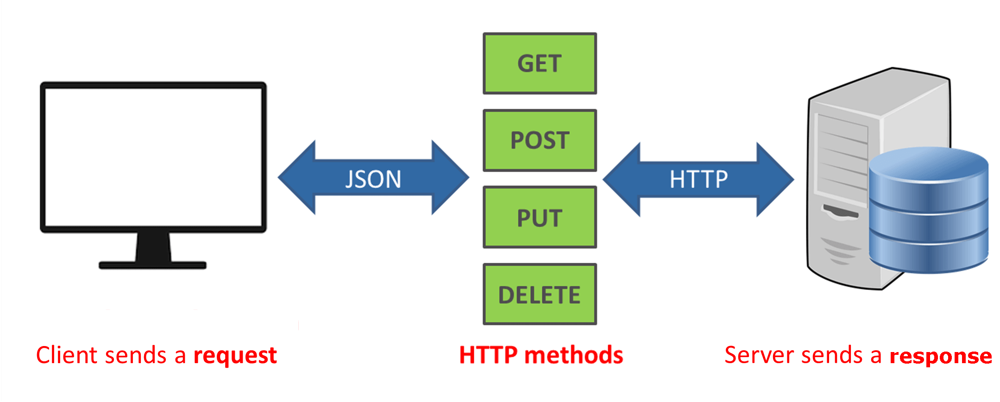

# Fake API - Conceitos

- Fornecer uma porta para o cliente acessar o serviço / banco de dados e fazer o CRUD
- Rest (Representational State Transfer) API é um conceito:
    1. Cliente-servidor: A API segue uma separação clara entre o cliente (interface do usuário ou aplicativo que consome a API) e o servidor (onde os dados e a lógica de negócios estão). Isso promove a independência entre os dois.
    
    2. Stateless (Sem estado): Cada requisição feita pelo cliente ao servidor deve conter todas as informações necessárias para processar o pedido. O servidor não deve armazenar o estado das requisições entre interações. Ou seja, cada requisição é independente.

    3. Cacheável: As respostas da API devem indicar se os dados podem ser armazenados em cache, o que permite que clientes reutilizem respostas sem fazer novas requisições ao servidor. Isso melhora a eficiência e reduz a carga no servidor.

    4. Interface uniforme: A comunicação entre cliente e servidor deve ser feita de maneira consistente e previsível. Algumas regras incluem:

        - Recursos: Cada recurso na API (como dados de um produto, usuário, etc.) deve ter um identificador único (geralmente uma URL).
        - Métodos HTTP: Os métodos HTTP (GET, POST, PUT, DELETE) devem ser usados de maneira padronizada para operações em recursos.
        - Representações: Os recursos devem ser retornados em uma representação padronizada (como JSON ou XML), e a comunicação deve ser autodescritiva.

    5. Sistema em camadas: A arquitetura REST permite que existam camadas intermediárias entre o cliente e o servidor (como proxies, gateways ou balanceadores de carga) sem que o cliente precise saber. Isso melhora a modularidade e a escalabilidade.

    6. Code on Demand (opcional): Embora raramente implementado, esse princípio permite que o servidor envie código executável (como scripts) para o cliente, que o executa dinamicamente.

- Seguir esses princípios garante que uma API seja RESTful, ou seja, se adeque ao estilo arquitetural REST.

